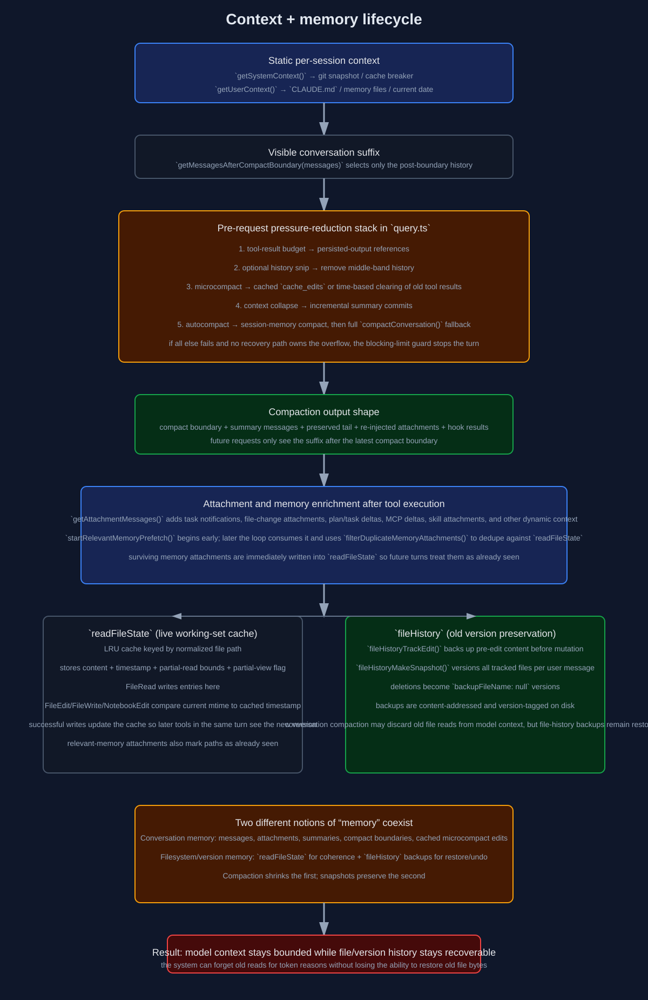

# Context and Memory Lifecycle Deep Dive

This document covers how Claude Code manages context before each model call, how it compacts or trims history over time, how it keeps tool-call state coherent across iterations, and how it tracks file versions for stale-read prevention and restore flows.

Primary implementation files:

- `/home/runner/work/claude-code/claude-code/src/context.ts`
- `/home/runner/work/claude-code/claude-code/src/query.ts`
- `/home/runner/work/claude-code/claude-code/src/utils/attachments.ts`
- `/home/runner/work/claude-code/claude-code/src/services/compact/autoCompact.ts`
- `/home/runner/work/claude-code/claude-code/src/services/compact/compact.ts`
- `/home/runner/work/claude-code/claude-code/src/services/compact/microCompact.ts`
- `/home/runner/work/claude-code/claude-code/src/services/compact/sessionMemoryCompact.ts`
- `/home/runner/work/claude-code/claude-code/src/utils/fileStateCache.ts`
- `/home/runner/work/claude-code/claude-code/src/utils/fileHistory.ts`
- `/home/runner/work/claude-code/claude-code/src/tools/FileReadTool/FileReadTool.ts`
- `/home/runner/work/claude-code/claude-code/src/tools/FileEditTool/FileEditTool.ts`
- `/home/runner/work/claude-code/claude-code/src/tools/FileWriteTool/FileWriteTool.ts`

Raw SVG: [`../images/context/context-memory-flow.svg`](../images/context/context-memory-flow.svg)

## 1. Context is built from multiple layers

Claude Code's effective context is not just the visible conversation text. Before every API call, the model-visible context is composed from:

1. the visible conversation suffix after the latest compact boundary
2. system context from `/home/runner/work/claude-code/claude-code/src/context.ts`
3. user context from `/home/runner/work/claude-code/claude-code/src/context.ts`
4. attachment messages generated after tool execution
5. memory attachments and skill attachments
6. any prompt-cache edits or compact boundaries created by compaction systems

This means there are really three different things to keep distinct:

- **full conversation state** kept by `QueryEngine`
- **API-visible suffix** selected by `getMessagesAfterCompactBoundary()`
- **extra per-request context** added by system/user context and attachments

## 2. Static system and user context

`/home/runner/work/claude-code/claude-code/src/context.ts` builds two memoized maps.

### 2.1 System context

`getSystemContext()` may include:

- git status snapshot
- current branch and default branch
- recent commits
- git user name
- optional cache-breaker injection

Important detail: git status is a point-in-time snapshot taken once and memoized. It does not automatically update during the conversation.

### 2.2 User context

`getUserContext()` may include:

- aggregated `CLAUDE.md` / memory-file content
- current date

It respects:

- `CLAUDE_CODE_DISABLE_CLAUDE_MDS`
- bare mode behavior
- extra directories explicitly added for `CLAUDE.md` discovery

This context is also memoized for the session until explicitly invalidated.

## 3. The five in-loop context pressure layers

Before the API call in each loop iteration, `query.ts` runs a stack of context-management mechanisms in a fixed order.

### 3.1 Tool-result budget

`applyToolResultBudget()` limits oversized tool results before any other compaction occurs.

Effects:

- very large tool results are replaced by persisted references
- replacement records can be stored in session storage for resume
- tools with infinite / explicit result limits are exempted

This is the cheapest and most local pressure relief.

### 3.2 History snip

If `HISTORY_SNIP` is enabled, `snipCompactIfNeeded()` can remove a middle section of the visible history.

Why it exists:

- some conversations accumulate lots of low-value history in the middle
- full compaction is heavier and more lossy than simply snipping a cold middle band

The loop keeps `snipTokensFreed` because later token estimation can otherwise be stale.

### 3.3 Microcompact

`microcompactMessages()` is a lighter-weight tool-result cleanup layer.

#### Cached microcompact

When supported, older compactable tool results are not locally mutated. Instead:

- tool-use IDs are registered in a cached-MC state machine
- old IDs selected for deletion are turned into `cache_edits`
- `consumePendingCacheEdits()` hands those edits to the API layer once
- after the API call, a boundary message can be emitted with actual deleted-token counts

This path is optimized to preserve prompt-cache hits.

#### Time-based microcompact

When the last assistant message is old enough that the cache is assumed cold, older tool-result content is replaced in local messages with `[Old tool result content cleared]`.

Important side effect:

- cached-MC state is reset because local message mutation invalidates the assumptions that make cache editing safe.

### 3.4 Context collapse

When enabled, context collapse performs incremental summary commits rather than waiting for one large compact.

It works as a separate context-management system and can also recover from overflow by draining staged collapses when a real 413 occurs.

### 3.5 Autocompact

`autoCompactIfNeeded()` is the heaviest layer.

It computes:

- effective context window = model context window minus reserved summary/output headroom
- autocompact threshold = effective window minus `AUTOCOMPACT_BUFFER_TOKENS`

If above threshold, it attempts:

1. session-memory compaction
2. full `compactConversation()`

If repeated attempts fail, the circuit breaker disables further autocompact attempts for the session.

## 4. Session-memory compaction

`/home/runner/work/claude-code/claude-code/src/services/compact/sessionMemoryCompact.ts` is the first compaction path tried by autocompact.

Its job is to preserve a recent working tail while using session memory to summarize older conversation state.

Key points:

- config is remotely adjustable through GrowthBook and cached once per session.
- it enforces minimum preserved-token and text-message counts.
- `adjustIndexToPreserveAPIInvariants()` makes sure the preserved tail does not split:
  - `tool_use` / `tool_result` pairs
  - assistant streaming fragments with the same underlying `message.id`
  - thinking blocks that must remain attached to their assistant trajectory
- it can annotate the compact boundary with preserved-segment metadata so resume logic can relink the preserved suffix correctly.

This path is lighter than full compaction because it does not always require summarizing the entire visible history into a new large synthetic summary.

## 5. Full compaction with `compactConversation()`

`compactConversation()` in `/home/runner/work/claude-code/claude-code/src/services/compact/compact.ts` is the general-purpose summarization path.

### 5.1 Pre-processing

Before summarization it can:

- strip image/document blocks to avoid the compact call itself hitting prompt-too-long
- strip attachments that will be re-injected anyway
- execute pre-compact hooks and merge hook-provided custom instructions

### 5.2 Summarization path

It builds a special compact prompt and runs a forked agent to summarize the conversation.

If the compact request itself hits prompt-too-long:

- `truncateHeadForPTLRetry()` drops oldest API-round groups
- a synthetic user marker can be inserted if necessary so the retried summarize input still begins with a user role
- retries continue up to the configured PTL retry limit

### 5.3 Result structure

A compaction result can contain:

- `boundaryMarker`
- `summaryMessages`
- `messagesToKeep`
- `attachments`
- `hookResults`
- token accounting info
- optional relink metadata for preserved segments

`buildPostCompactMessages()` is then used to build the canonical post-compact visible sequence.

## 6. Compact boundaries and the visible history suffix

Every successful compaction inserts a compact boundary system message.

Later, `getMessagesAfterCompactBoundary(messages)` finds the latest boundary and returns only the suffix after it. That function is what makes compaction actually matter for future API requests.

This has two consequences:

- the UI/session may still keep older messages for display/resume purposes
- the model only sees the post-boundary suffix

So compaction is implemented as **boundary-based visibility**, not by always deleting everything older from memory immediately.

## 7. Reactive compaction and overflow recovery

Reactive compaction is the repair path when the API itself rejects the current prompt.

In `query.ts`, after a streaming attempt ends with a withheld prompt-too-long or media-size error, the loop can:

1. ask context collapse to drain staged collapses
2. ask reactive compact to repair the message set and retry
3. if no repair path works, surface the original withheld error

This makes reactive compact the last line of defense when proactive compaction either did not fire or was insufficient.

## 8. Attachments as context, not just metadata

A big part of context management happens after tool execution in `getAttachmentMessages()`.

These attachment messages are part of the next loop iteration's conversation state and can include:

- task notifications
- file-edit diff snippets
- plan attachments
- task list deltas
- deferred tool deltas
- MCP instruction deltas
- relevant memories
- dynamic skill discoveries
- IDE selection and diagnostics context

This matters because context growth is not only driven by direct conversation messages; attachments can significantly increase the visible suffix between iterations.

## 9. Relevant-memory prefetch

The loop starts relevant-memory prefetch at the beginning of the turn via `startRelevantMemoryPrefetch(...)`.

Characteristics:

- only enabled when auto-memory and the experiment gate are on
- uses the last non-meta user message as the search input
- skips trivial one-word prompts
- is chained to the turn abort controller, so Escape cancels it
- stores `settledAt` and `consumedOnIteration` so the loop can opportunistically consume it later without blocking early iterations

This is a latency-hiding optimization: memory search runs in the background while the main model stream or tools execute.

## 10. Deduping surfaced memories with `readFileState`

`filterDuplicateMemoryAttachments()` is subtle and important.

It filters prefetched memories against `readFileState`, which is cumulative across iterations and turns. That means a memory file is not re-surfaced if the model has already seen it through:

- a previous memory attachment
- a FileRead tool call
- an Edit/Write path that updated the read cache

After filtering, surviving memory attachments are immediately written into `readFileState`, so later turns treat them as already seen.

This is one of the main bridges between context management and file-state tracking.

## 11. `readFileState`: the working file-view cache

`/home/runner/work/claude-code/claude-code/src/utils/fileStateCache.ts` defines `FileStateCache`, an LRU cache keyed by normalized file path.

Each entry stores:

- file content
- timestamp / mtime snapshot
- optional offset and limit for partial reads
- optional `isPartialView`

### 11.1 Why the cache exists

It serves multiple runtime needs:

- lets tools know what file content the model has already seen
- supports \"file unchanged\" short-circuit behavior in FileRead
- supports stale-write protection in FileEdit / FileWrite / NotebookEdit
- lets surfaced memories be treated as already seen context

### 11.2 FileRead writes into the cache

`FileReadTool` stores read results into `readFileState` with the current mtime.

It can also emit a `file_unchanged` stub if the same path was read before and the file mtime is unchanged, telling the model to reuse the earlier in-conversation result rather than paying context cost for a duplicate full read.

### 11.3 Edit / Write tools read from the cache

`FileEditTool` and `FileWriteTool` use the cached read timestamp to detect staleness.

Typical pattern:

1. look up the cached `FileState` for the path
2. compare current file modification time to cached timestamp
3. if timestamps differ, sometimes fall back to content comparison on platforms with coarse timestamps
4. reject the write/edit if the file changed externally since the last seen version
5. after a successful write, update `readFileState` with the new content and timestamp

This is how the system keeps the model from editing a stale local view of a file.

## 12. How file state evolves across tool calls in one turn

Because `toolUseContext.readFileState` is shared across the loop iteration and carried forward into the next one, tool calls within a turn see each other's updates.

Example:

1. FileRead reads `a.ts` and caches content `v1`.
2. FileEdit modifies `a.ts` to `v2` and updates the cache immediately.
3. A later FileEdit or FileWrite in the same turn now sees `v2` as the current model-known version.

So the cache is not just historical bookkeeping; it is the live cross-tool working set for the turn.

## 13. Subagent and merge behavior for file-state caches

`QueryEngine` clones the read-file cache when constructing engine instances for isolated contexts. `mergeFileStateCaches()` merges by keeping the newer timestamp for each path.

This prevents older subagent views from overwriting fresher main-thread file state when contexts are reconciled.

## 14. File history: preserving old file versions

`/home/runner/work/claude-code/claude-code/src/utils/fileHistory.ts` is the old-version / restore system.

### 14.1 Core state

`FileHistoryState` tracks:

- `snapshots[]`
- `trackedFiles`
- `snapshotSequence`

Each snapshot stores:

- the triggering message UUID
- a map from file path to backup version metadata
- a timestamp

Each backup records:

- backup filename (or `null` if the file did not exist in that version)
- monotonic version number
- backup time

### 14.2 `fileHistoryTrackEdit()`

This is called before actual edits/writes.

Purpose:

- ensure the pre-edit content is backed up before mutation
- avoid overwriting version-1 backups if the same file is tracked again in the same snapshot
- retroactively add the backup to the most recent snapshot if needed

Important design detail:

- it first captures current state with a no-op updater
- performs filesystem I/O outside the state updater
- then commits the backup metadata in a second updater

That avoids long-running I/O inside state updates while still keeping snapshot state coherent.

### 14.3 `fileHistoryMakeSnapshot()`

This is called once per user message (when enabled).

It:

- iterates all tracked files
- stats each file
- creates a new backup version if the file changed since the last backup
- records `backupFileName: null` if the tracked file has been deleted

The function keeps old versions even if the user never explicitly asks for a restore later.

### 14.4 Storage format and deduplication

Backups are content-addressed by hash with version tags. The system tries to create a hard link first and falls back to copy if needed.

That means:

- identical content across versions can be cheap to store
- version history still remains explicit in the snapshot metadata

### 14.5 Snapshot cap

The in-memory snapshot list is capped (`MAX_SNAPSHOTS = 100`), but the backup files themselves are persisted independently. The cap limits live in-memory bookkeeping rather than meaning older disk backups vanish immediately.

## 15. How old file versions relate to model-visible context

There are two separate timelines:

### 15.1 Conversation timeline

The model sees file content through tool results and attachments stored in the message history.

Those older tool results may later be:

- left intact
- replaced by a `file_unchanged` stub on future reads
- microcompacted / cache-edited away
- summarized away by compaction

### 15.2 Filesystem history timeline

Independently, file-history backups keep actual old file versions on disk, keyed to snapshots.

That means the system can simultaneously:

- reduce context pressure by clearing/summarizing old file reads in the conversation
- still preserve old file bytes for restore/undo purposes outside the model-visible history

This separation is crucial: context compaction does **not** mean loss of file restore history.

## 16. QueryEngine persistence and compaction boundaries

`QueryEngine.submitMessage()` records compact boundaries and transcript writes carefully so resume can reconstruct history correctly.

Important behaviors:

- when a compact boundary with preserved-segment metadata is yielded, transcript is flushed through the preserved tail before the boundary is recorded.
- assistant messages are usually written fire-and-forget to avoid blocking streaming.
- compact-boundary and user messages are persisted more synchronously when needed.

So context compaction is coordinated with transcript persistence; they are not separate concerns.

## 17. Practical summary of how context is kept coherent over time

Claude Code maintains coherence through several cooperating mechanisms:

### Pressure reduction

- tool-result budgeting
- snip
- microcompact
- context collapse
- autocompact / reactive compact

### Context enrichment

- system context
- user context / `CLAUDE.md`
- attachment generation
- relevant-memory surfacing
- dynamic skill discovery

### Cross-tool coherence

- shared `readFileState`
- stale-write checks on Edit/Write tools
- memory dedupe against the read cache
- per-turn and per-session transcript persistence

### Historical preservation

- compact boundaries preserving a visible suffix model
- transcript storage preserving yielded history
- file-history backups preserving old file bytes and deletions

## 18. Source map for this document

- `/home/runner/work/claude-code/claude-code/src/context.ts`
- `/home/runner/work/claude-code/claude-code/src/query.ts`
- `/home/runner/work/claude-code/claude-code/src/utils/attachments.ts`
- `/home/runner/work/claude-code/claude-code/src/services/compact/autoCompact.ts`
- `/home/runner/work/claude-code/claude-code/src/services/compact/compact.ts`
- `/home/runner/work/claude-code/claude-code/src/services/compact/microCompact.ts`
- `/home/runner/work/claude-code/claude-code/src/services/compact/sessionMemoryCompact.ts`
- `/home/runner/work/claude-code/claude-code/src/utils/fileStateCache.ts`
- `/home/runner/work/claude-code/claude-code/src/utils/fileHistory.ts`
- `/home/runner/work/claude-code/claude-code/src/tools/FileReadTool/FileReadTool.ts`
- `/home/runner/work/claude-code/claude-code/src/tools/FileEditTool/FileEditTool.ts`
- `/home/runner/work/claude-code/claude-code/src/tools/FileWriteTool/FileWriteTool.ts`
