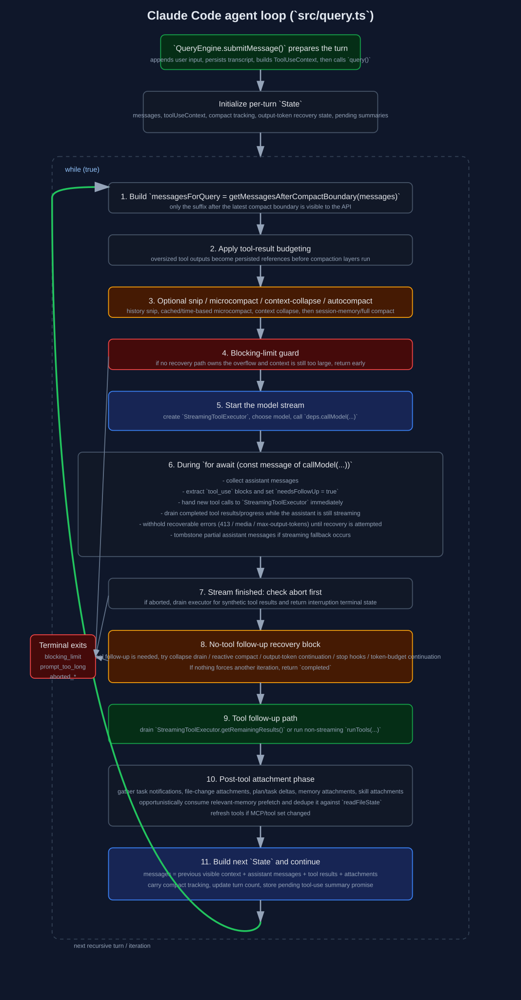

# Agent Loop Deep Dive

This document explains the core agent loop implemented in `/home/runner/work/claude-code/claude-code/src/query.ts`, with supporting context from `/home/runner/work/claude-code/claude-code/src/QueryEngine.ts`, `/home/runner/work/claude-code/claude-code/src/services/tools/StreamingToolExecutor.ts`, `/home/runner/work/claude-code/claude-code/src/services/tools/toolOrchestration.ts`, and related compaction / attachment code.

The focus here is the actual runtime flow: how a user turn becomes API requests, how tool calls are streamed and executed, how retries and recovery work, and how the loop decides that a turn is done.

Raw SVG: [`../images/internals/agent-loop-flow.svg`](../images/internals/agent-loop-flow.svg)

## 1. Where the loop sits

At a high level the runtime path is:

1. `/home/runner/work/claude-code/claude-code/src/entrypoints/cli.tsx` boots globals and enters the app.
2. `/home/runner/work/claude-code/claude-code/src/main.tsx` configures the CLI / REPL entry.
3. `/home/runner/work/claude-code/claude-code/src/QueryEngine.ts` owns one conversation's persistent state.
4. `QueryEngine.submitMessage()` prepares the turn, persists the user input, and calls `query()`.
5. `/home/runner/work/claude-code/claude-code/src/query.ts` runs `queryLoop()` until it reaches a terminal condition.

`QueryEngine` is the conversation-level owner. `queryLoop()` is the turn-level execution engine.

## 2. What `QueryEngine` owns vs what `queryLoop()` owns

### `QueryEngine` owns session-persistent state

`QueryEngine` persists across user turns and owns:

- `mutableMessages`: the conversation transcript kept in memory for the session.
- `readFileState`: the file-read cache used by Read/Edit/Write tools.
- total usage accounting and permission denial tracking.
- transcript persistence and eager-flush behavior.
- the session-level abort controller.
- file-history snapshot scheduling.

Important consequence: `queryLoop()` receives a snapshot of the current conversation state, but `QueryEngine` is the long-lived owner that records yielded messages back into `mutableMessages` and into transcript storage.

### `queryLoop()` owns one recursive / multi-iteration turn

`queryLoop()` owns the per-turn mutable `State` object:

- `messages`
- `toolUseContext`
- compaction tracking
- max-output-token recovery state
- pending tool-use summary promise
- current turn count and previous transition reason

The loop is not recursive in implementation, but it behaves recursively: when the assistant emits `tool_use`, the loop appends tool results and `continue`s with a new `State`, effectively creating the next turn in the same conversation.

## 3. Entry behavior before the loop starts

Before `queryLoop()` is entered, `QueryEngine.submitMessage()` does several things that are easy to miss but are important to understanding resume / state correctness:

### 3.1 It appends user input before any API call happens

`processUserInput()` can emit:

- one or more user messages
- slash-command outputs
- compact-boundary messages
- system messages
- attachments

These are appended into `mutableMessages` immediately.

### 3.2 It records transcript before the model responds

`QueryEngine.submitMessage()` persists the accepted user messages to transcript storage before entering the query loop. This avoids a failure mode where the process dies after accepting the user prompt but before the first assistant message is yielded, which would otherwise make resume impossible.

### 3.3 It schedules file-history snapshots at the start of the turn

If file checkpointing is enabled, `fileHistoryMakeSnapshot()` is queued for newly accepted user-authored messages. That snapshotting logic is session-scoped and independent of whether the upcoming model call succeeds.

### 3.4 It rebuilds `processUserInputContext`

After user-input processing, `QueryEngine` rebuilds the tool-use context so it reflects the updated message list, selected model, app state, `readFileState`, discovered skills, and file-history updater.

## 4. The loop state model in `src/query.ts`

`query()` is a thin wrapper around `queryLoop()` that also tracks consumed queued-command UUIDs and emits command lifecycle completion when the turn returns normally.

`queryLoop()` carries a single mutable `State` object between iterations. It is intentionally replaced wholesale at each `continue` site rather than being updated field-by-field.

The key fields are:

- `messages`: the current working conversation.
- `toolUseContext`: all tool/runtime services for the turn.
- `autoCompactTracking`: tracks whether compaction already happened and how many turns since.
- `maxOutputTokensRecoveryCount`: limits continuation retries after output-token caps.
- `hasAttemptedReactiveCompact`: prevents repeated reactive compaction spirals.
- `maxOutputTokensOverride`: allows escalation to a larger output cap for retry.
- `pendingToolUseSummary`: an async summary of the previous tool batch.
- `stopHookActive`: indicates stop hooks already injected blocking content.
- `turnCount`: the effective recursive turn count.
- `transition`: why the previous loop iteration continued.

## 5. Per-iteration pipeline

Each `while (true)` iteration in `/home/runner/work/claude-code/claude-code/src/query.ts` follows the same broad structure.

### 5.1 Start-of-iteration setup

The loop:

- clones the current `toolUseContext` and augments it with fresh query-chain tracking.
- yields `stream_request_start`.
- starts a per-turn relevant-memory prefetch handle once, outside the loop body, and opportunistically consumes it later.
- starts a per-iteration skill-discovery prefetch.

### 5.2 Restrict to post-compact history

The loop first does:

- `getMessagesAfterCompactBoundary(messages)`

This is the key boundary rule: after compaction, only the segment after the latest compact boundary is visible to the API. The full older history may still exist in the REPL / `QueryEngine` state, but the model only sees the visible suffix.

### 5.3 Apply tool-result budgeting

`applyToolResultBudget()` runs before any compaction layer.

Purpose:

- enforce per-message result budgets on oversized tool outputs.
- replace large tool result bodies with references / persisted-output markers.
- optionally persist replacement records for resumable sessions.

This matters because later compaction mechanisms operate on the already-budgeted conversation.

### 5.4 Optional history snip

If `HISTORY_SNIP` is enabled, `snipCompactIfNeeded()` can remove history from the middle of the working context.

Outputs:

- `messages`: possibly reduced message list.
- `tokensFreed`: approximate savings fed into later threshold checks.
- optional boundary message yielded to the caller.

The crucial subtlety is that token estimation can otherwise be stale because surviving assistant usage metadata still reflects the larger pre-snip context.

### 5.5 Microcompact

`microcompactMessages()` runs before autocompact.

Possible behaviors:

- **cached microcompact**: keeps local messages unchanged, but queues `cache_edits` for the API layer so the server cache can drop older tool results without invalidating the cached prefix.
- **time-based microcompact**: if the last assistant message is old enough that the cache is presumed cold, it mutates older `tool_result` blocks in-place to `[Old tool result content cleared]`.

If cached microcompact queued edits, `queryLoop()` remembers that and waits until after the API response to emit the boundary message, because it wants the actual `cache_deleted_input_tokens` reported by the API rather than a client estimate.

### 5.6 Context collapse

If `CONTEXT_COLLAPSE` is enabled, `applyCollapsesIfNeeded()` projects the visible conversation through the collapse system and may commit more staged collapses.

This runs before autocompact because collapse may already solve the token-pressure problem.

### 5.7 Autocompact

`autoCompactIfNeeded()` runs next.

Flow:

1. Skip entirely for recursion-sensitive query sources like `compact` and `session_memory`.
2. Respect global disable flags and auto-compact user settings.
3. Skip when reactive-compact-only or context-collapse mode owns overflow management.
4. Check token count against `getAutoCompactThreshold()`.
5. If over threshold:
   - try `trySessionMemoryCompaction()` first
   - else fall back to `compactConversation()`
6. If compaction succeeds:
   - reset state that depends on message IDs
   - emit compact result messages immediately
   - continue the same query call using the compacted message list
7. If compaction fails repeatedly:
   - increment `consecutiveFailures`
   - stop retrying after the circuit breaker trips

### 5.8 Blocking-limit guard

If the turn is still too large and automatic recovery does not own the problem, `calculateTokenWarningState()` can force an immediate blocking error before the API call.

This is different from autocompact:

- autocompact is proactive and tries to repair the turn.
- the blocking-limit guard is a hard stop that preserves room for manual `/compact`.

### 5.9 Build the API call state

At this point the loop has:

- `messagesForQuery`: the API-visible, possibly compacted/snipped/collapsed context.
- `fullSystemPrompt`: base system prompt plus system context.
- `toolUseContext.messages`: updated to the exact message list the tools will consider current.

The loop also decides:

- whether to use `StreamingToolExecutor`
- which runtime model variant to use (for example in plan mode with huge history)
- the per-turn dump-prompts fetch override for diagnostics.

## 6. The API streaming phase

The core model call is made via `deps.callModel(...)`, typically backed by `/home/runner/work/claude-code/claude-code/src/services/api/claude.ts`.

The loop then processes the stream in a `for await`.

### 6.1 What gets collected during streaming

The loop maintains:

- `assistantMessages[]`
- `toolResults[]`
- `toolUseBlocks[]`
- `needsFollowUp`

For every assistant message:

- it is appended to `assistantMessages`.
- any `tool_use` blocks are extracted and appended to `toolUseBlocks`.
- `needsFollowUp = true` if any tool call was seen.

### 6.2 Observable-input backfilling for streamed tool calls

Before yielding an assistant message, the loop may clone the tool-use input and run `tool.backfillObservableInput(inputCopy)`.

Important detail:

- the cloned message is only for yielding / transcript compatibility.
- the original assistant message is preserved for prompt-cache correctness on retries.

### 6.3 Withheld error messages

Some assistant error messages are deliberately not yielded immediately:

- prompt-too-long
- media-size errors
- max-output-tokens

They are still stored in `assistantMessages`, but withheld from the caller until the loop knows whether recovery will succeed.

This prevents SDK clients from seeing an intermediate failure and prematurely terminating a turn that is actually recoverable.

### 6.4 Streaming fallback handling

If the lower API layer triggers a fallback during streaming:

- already-yielded partial assistant messages are tombstoned.
- `assistantMessages`, `toolResults`, and `toolUseBlocks` are cleared.
- the current `StreamingToolExecutor` is discarded.
- a new executor is created.
- the loop retries, potentially with a fallback model.

This prevents orphaned tool results or invalid thinking-block signatures from leaking into the retry.

## 7. Streaming tool execution

When enabled, the loop starts executing tools before the assistant finishes streaming.

### 7.1 `StreamingToolExecutor` model

`/home/runner/work/claude-code/claude-code/src/services/tools/StreamingToolExecutor.ts` maintains per-tool state:

- `queued`
- `executing`
- `completed`
- `yielded`

Each tracked tool records:

- the `ToolUseBlock`
- source assistant message
- concurrency-safety classification
- buffered results
- buffered progress messages
- context modifiers

### 7.2 Concurrency rules

A tool is treated as concurrency-safe if its parsed input passes `tool.isConcurrencySafe(...)`.

Rules:

- multiple concurrency-safe tools may run in parallel.
- a non-concurrent tool can only run when nothing else is executing.
- once a non-concurrent queued tool is encountered and cannot run yet, queue processing stops to preserve ordering.

### 7.3 Abort and synthetic error generation

The executor has a child `siblingAbortController` derived from the query abort controller.

If a Bash tool errors:

- the executor marks `hasErrored = true`
- aborts the sibling controller with `sibling_error`
- queued or running siblings synthesize tool-result error messages rather than continuing blindly

It also synthesizes errors for:

- user interruption
- streaming fallback discard

This ensures the conversation never contains a `tool_use` without a matching `tool_result`.

### 7.4 Progress delivery

Progress messages are not stored inline with final results. They are kept in `pendingProgress[]` and yielded as soon as possible.

That lets the UI surface Bash progress even while earlier tools are still executing or waiting on ordering constraints.

## 8. Non-streaming tool execution path

If streaming tool execution is unavailable, the loop falls back to `runTools()` from `/home/runner/work/claude-code/claude-code/src/services/tools/toolOrchestration.ts`.

That path:

- partitions tool calls into batches.
- groups consecutive concurrency-safe tools.
- runs safe batches concurrently and unsafe batches serially.
- applies queued context modifiers after concurrent batches complete.

So the high-level semantics match the streaming path, but tool execution starts only after the assistant stream is finished.

## 9. Recovery paths after streaming ends

When the stream is done, the loop decides what to do next.

### 9.1 Immediate abort path

If the query abort controller is aborted after streaming:

- the streaming executor is drained so synthetic results are produced for in-flight tools.
- a user interruption message is yielded unless this was the submit-interrupt special case.
- turn cleanup hooks may run.
- the loop returns `aborted_streaming`.

### 9.2 Delayed tool-use summary emission

If a tool-use summary promise from the previous turn is ready, it is yielded now. This work is intentionally overlapped with model streaming so it does not block the previous turn.

### 9.3 No-follow-up path

If `needsFollowUp` is false, the model did not request tools. This is the natural stop candidate, but several recovery checks run first.

#### Prompt-too-long recovery

If the last assistant message was a withheld 413 error:

1. If context-collapse is enabled and hasn't already drained staged collapses for this failure, call `recoverFromOverflow()` and retry.
2. Else try `reactiveCompact.tryReactiveCompact(...)`.
3. If either succeeds, emit compact result messages and continue with fresh state.
4. If both fail, yield the withheld error and stop.

#### Media-size recovery

If the last message was a withheld media-size error:

- skip collapse recovery
- try reactive compact's strip-and-retry path
- if that fails, surface the withheld error and stop

#### Max-output-tokens recovery

If the last message was a withheld max-output-tokens error:

1. Optionally escalate from the default cap to `ESCALATED_MAX_TOKENS` once.
2. Then, up to `MAX_OUTPUT_TOKENS_RECOVERY_LIMIT` times, append a synthetic meta user message telling the model to resume directly and continue.
3. After retries are exhausted, surface the error.

#### Stop hooks

If there is still no tool follow-up:

- skip stop hooks entirely for API error messages.
- otherwise run `handleStopHooks(...)`.
- if stop hooks inject blocking errors, append them and continue.
- if they prevent continuation, return immediately.

#### Token budget continuation

If `TOKEN_BUDGET` is enabled, the loop may inject a budget nudge and continue even without tool calls. This is another form of recursive turn extension.

If no recovery or forced continuation occurs, the loop returns `{ reason: 'completed' }`.

## 10. Follow-up path when tools were requested

If `needsFollowUp` is true, the loop must execute tools and recurse.

### 10.1 Drain tool updates

The loop picks one of:

- `streamingToolExecutor.getRemainingResults()`
- `runTools(...)`

For each update:

- yielded message is sent outward immediately
- user-form tool results are normalized and appended into `toolResults[]`
- context updates are applied to `updatedToolUseContext`

### 10.2 Tool-use summary generation for the next iteration

If enabled, and this is the main thread, the loop kicks off an async Haiku summary generation task that describes the tool batch. That promise is stored in the next iteration's `pendingToolUseSummary`.

### 10.3 Tool-phase aborts

If the turn is aborted during tool execution:

- emit interruption message (unless this was submit-interrupt)
- optionally emit max-turns attachment if the abort happened after the effective turn count crossed the limit
- return `aborted_tools`

### 10.4 Attachment phase

After tool execution and before recursion, the loop gathers attachments via `getAttachmentMessages(...)`.

This includes:

- queued task notifications and prompts addressed to the current agent/main thread
- file-change attachments
- plan-related attachments
- MCP instruction deltas
- task deltas
- relevant memory attachments
- skill-discovery attachments
- other dynamic context attachments

The loop then removes only the queued commands that were actually consumed.

### 10.5 Relevant memory prefetch consumption

The relevant-memory prefetch is started once per user turn but only consumed opportunistically once it has settled.

Key detail:

- `filterDuplicateMemoryAttachments()` checks `readFileState` so memories already surfaced via Read/Edit/Write or previous attachment injection are not re-added.
- surviving memory attachments are then marked in `readFileState`, so later iterations and later turns treat them as already in context.

### 10.6 Tool refresh

If `refreshTools` exists in the tool options, it is called here so newly connected MCP tools become available on the next iteration.

### 10.7 Turn limit and recursion

Before looping:

- `nextTurnCount = turnCount + 1`
- if `maxTurns` would be exceeded, yield a `max_turns_reached` attachment and stop.
- otherwise create the next `State` with:
  - `messages: [...messagesForQuery, ...assistantMessages, ...toolResults]`
  - updated `toolUseContext`
  - carried compaction tracking
  - fresh pending tool-use summary promise
  - reset output-token recovery state

Then the `while (true)` iteration begins again.

## 11. How the loop knows the turn is finished

The loop stops only when one of its terminal branches returns a `Terminal` result.

Major terminal reasons include:

- `completed`
- `blocking_limit`
- `prompt_too_long`
- `image_error`
- `model_error`
- `aborted_streaming`
- `aborted_tools`
- `hook_stopped`
- `stop_hook_prevented`
- `max_turns`

Conceptually the turn is finished only when **all** of the following are true:

- the model stream ended without unresolved recovery work
- no pending tool follow-up remains
- no stop hook forced another iteration
- no token-budget continuation forced another iteration
- max-turns / abort / blocking conditions did not short-circuit first

## 12. Persistence and transcript semantics

`QueryEngine.submitMessage()` records yielded assistant/user/compact-boundary messages into both memory and transcript storage.

Important transcript behaviors:

- assistant messages are generally persisted fire-and-forget to avoid blocking the stream.
- compact-boundary writes force a transcript flush up to the preserved tail when necessary, so resume can reconstruct preserved-segment relinks correctly.
- transcript writes happen during the `for await (const message of query(...))` consumer loop, not inside `queryLoop()` itself.

That separation is important: `queryLoop()` owns control flow, but `QueryEngine` owns durable storage.

## 13. Supporting API-layer details that matter to the loop

The loop relies on behavior in `/home/runner/work/claude-code/claude-code/src/services/api/claude.ts`.

Two especially important ones:

### 13.1 Pending cached-microcompact edits are consumed once per request build

`consumePendingCacheEdits()` and `getPinnedCacheEdits()` are called once before request-param construction, because request params may be built multiple times for retries/logging. Consuming inside param construction would lose edits on retry.

### 13.2 Stream resources are explicitly released

The API layer tracks the raw stream and `Response` body and explicitly cancels them on exit to avoid native-memory leaks. This is one reason the loop can retry or fallback multiple times in long sessions without leaking resources as aggressively.

## 14. Source map for this document

Primary files:

- `/home/runner/work/claude-code/claude-code/src/query.ts`
- `/home/runner/work/claude-code/claude-code/src/QueryEngine.ts`
- `/home/runner/work/claude-code/claude-code/src/services/tools/StreamingToolExecutor.ts`
- `/home/runner/work/claude-code/claude-code/src/services/tools/toolOrchestration.ts`
- `/home/runner/work/claude-code/claude-code/src/services/tools/toolExecution.ts`
- `/home/runner/work/claude-code/claude-code/src/services/compact/autoCompact.ts`
- `/home/runner/work/claude-code/claude-code/src/services/compact/compact.ts`
- `/home/runner/work/claude-code/claude-code/src/services/compact/microCompact.ts`
- `/home/runner/work/claude-code/claude-code/src/utils/attachments.ts`
- `/home/runner/work/claude-code/claude-code/src/services/api/claude.ts`
