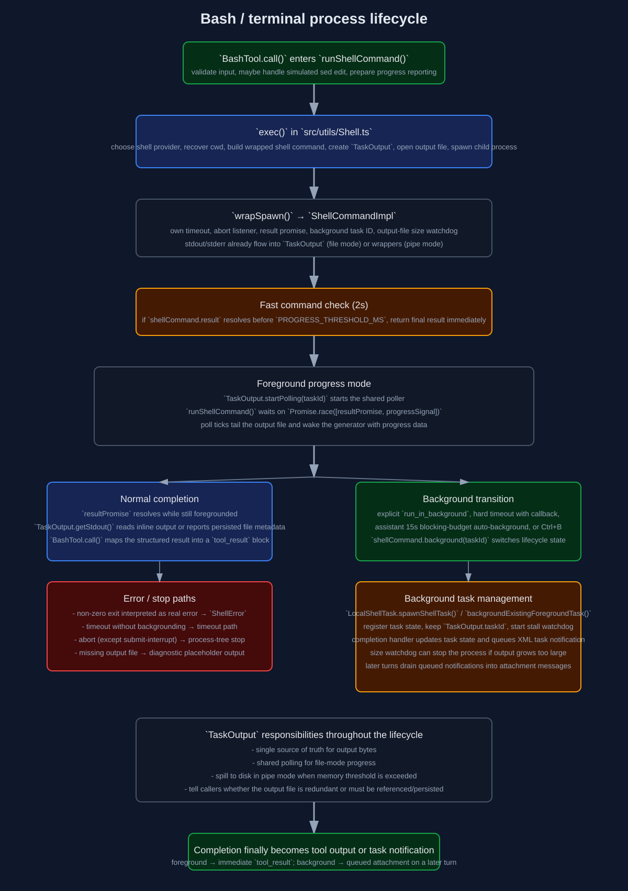

# Terminal and Process Lifecycle Deep Dive

This document covers the runtime process-handling path for terminal commands, focusing on lifecycle, progress, backgrounding, completion detection, and error handling rather than security policy.

Primary implementation files:

- `/home/runner/work/claude-code/claude-code/src/tools/BashTool/BashTool.tsx`
- `/home/runner/work/claude-code/claude-code/src/utils/Shell.ts`
- `/home/runner/work/claude-code/claude-code/src/utils/ShellCommand.ts`
- `/home/runner/work/claude-code/claude-code/src/utils/task/TaskOutput.ts`
- `/home/runner/work/claude-code/claude-code/src/tasks/LocalShellTask/LocalShellTask.tsx`

Raw SVG: [`../images/internals/terminal-lifecycle.svg`](../images/internals/terminal-lifecycle.svg)

## 1. High-level flow

For a Bash tool call the path is:

1. `BashTool.call()` validates input and permissions.
2. `runShellCommand()` starts a shell command generator.
3. `exec()` in `Shell.ts` chooses the shell, builds the wrapped command, opens the output file, and spawns the process.
4. `wrapSpawn()` creates a `ShellCommandImpl` that owns timeouts, abort handling, result resolution, and background promotion.
5. `TaskOutput` becomes the single source of truth for output.
6. `runShellCommand()` drives progress display, foreground/background transitions, and completion handoff back to the tool system.

## 2. Shell selection and process creation

### 2.1 How the shell is chosen

`getShellConfig()` memoizes shell detection for the session.

Selection order:

1. `CLAUDE_CODE_SHELL` override if it points to a valid bash/zsh binary.
2. `SHELL` environment variable if it is bash/zsh and executable.
3. discovered `which('zsh')` / `which('bash')` results.
4. fallback hard-coded paths such as `/bin/bash`, `/usr/bin/bash`, `/bin/zsh`, `/usr/local/bin/bash`, `/opt/homebrew/bin/bash`.

If none resolve, execution fails immediately with a descriptive fatal error.

### 2.2 What `exec()` does before spawn

Before spawning, `/home/runner/work/claude-code/claude-code/src/utils/Shell.ts`:

- resolves the proper shell provider.
- generates a random execution ID used inside the wrapped shell command.
- validates the current working directory with `realpath(cwd)`.
- if the cwd no longer exists, it tries to recover to `getOriginalCwd()`.
- if the abort signal is already aborted, it returns an `AbortedShellCommand` without spawning anything.
- creates a sandbox temp directory when sandboxing is enabled.
- creates a `TaskOutput` for the command.
- opens the output file in append mode for file-mode execution.

### 2.3 How stdout/stderr are wired

Normal Bash tool execution uses **file mode**:

- stdout and stderr both go directly to the same output file descriptor.
- they do not flow through JS event handlers.
- progress is later recovered by polling the file tail.

Hook-style executions can use **pipe mode** instead:

- stdout/stderr are buffered in memory.
- `StreamWrapper` writes incoming data to `TaskOutput`.
- output can spill to disk if it grows too large.

### 2.4 Why a shared output file is used

This design solves several runtime problems at once:

- shell output is available even if the command is later backgrounded.
- output ordering between stdout and stderr stays chronological because both file descriptors point to the same file.
- the process can continue writing after the foreground tool call returns.
- the UI can poll progress without keeping JS listeners attached to every live process.

## 3. `ShellCommandImpl`: the process lifecycle wrapper

`ShellCommandImpl` in `/home/runner/work/claude-code/claude-code/src/utils/ShellCommand.ts` wraps one spawned process.

### 3.1 States

A command can be in one of four states:

- `running`
- `backgrounded`
- `completed`
- `killed`

The wrapper also tracks:

- current timeout handle
- optional size-watchdog interval
- whether the process was killed for output size
- the background task ID if backgrounded
- abort listener and result resolver callbacks

### 3.2 Result promise creation

When constructed, the wrapper sets up:

- `childProcess.once('exit', ...)`
- `childProcess.once('error', ...)`
- a timeout timer
- an abort-signal listener

The public `result` promise resolves only through this wrapper, never by reading process state directly.

### 3.3 Why it listens to `exit`, not `close`

`ShellCommandImpl` intentionally uses `exit` because `close` waits for stdio to close. With shell commands that spawn grandchildren inheriting file descriptors, `close` could delay completion even after the shell itself has exited. `exit` reflects when control has truly returned from the shell command.

## 4. Abort handling

The wrapper's abort behavior depends on the signal reason.

### 4.1 Regular abort

If the abort signal is fired for a normal cancel/stop reason:

- `kill()` is called
- the whole process tree is terminated
- the result later resolves with `interrupted: true`

### 4.2 Submit-interrupt special case

If the abort reason is `'interrupt'`:

- the wrapper does **not** stop the process immediately
- the caller can background it instead

This is how the system stays responsive when the user submits another message while a command is still running.

## 5. Timeouts and automatic backgrounding

### 5.1 Timeout path inside `ShellCommandImpl`

When the timeout fires:

- if auto-backgrounding is available, `onTimeoutCallback` is invoked and the caller gets a chance to background the command.
- otherwise the wrapper stops the process tree with a timeout status.

### 5.2 Assistant-mode blocking budget

Separate from the hard timeout, `runShellCommand()` sets a 15-second assistant-mode budget (`ASSISTANT_BLOCKING_BUDGET_MS`).

If the command is still running after that budget:

- `assistantAutoBackgrounded = true`
- the command is moved into the background
- the model later receives a tool result explaining that the command was backgrounded to keep the main agent responsive

### 5.3 Explicit background requests

If the tool input contains `run_in_background: true`, `runShellCommand()` spawns the background task immediately and returns a result with `backgroundTaskId` instead of waiting for command completion.

## 6. `TaskOutput`: the single source of truth for output

`TaskOutput` in `/home/runner/work/claude-code/claude-code/src/utils/task/TaskOutput.ts` centralizes output management.

### 6.1 Two modes

#### File mode

Used by normal Bash commands:

- the child writes directly to a file descriptor
- JS only polls / reads the file later
- stderr is considered interleaved into stdout for display purposes

#### Pipe mode

Used by hook-like commands:

- data arrives in JS via `writeStdout()` / `writeStderr()`
- recent lines are stored in a circular buffer
- if in-memory size exceeds the limit, output spills to disk

### 6.2 Shared poller for progress

`TaskOutput` keeps a registry of file-mode instances that requested progress. `TaskOutput.startPolling(taskId)` adds one to the active polling set. A single shared interval ticks once per second and:

- tails up to 4096 bytes from each active output file
- estimates total line count if the whole file was not read
- calls the per-command `onProgress` callback with:
  - last few lines
  - larger recent tail
  - total lines
  - total bytes
  - whether the tail is incomplete

Important detail: the progress callback fires even when there is no new content, so the foreground loop can still wake up and notice that a background transition happened.

### 6.3 Output truncation and persistence behavior

When `getStdout()` is called:

- in file mode it reads up to `getMaxOutputLength()` bytes from the start of the output file.
- if the file fully fits in that range, the file is redundant and can be deleted.
- if not, the file path and file size are exposed so BashTool can persist / reference the full output.

If the file cannot be read (for example if another process deleted it), `TaskOutput` returns a diagnostic placeholder string instead of silently returning empty output.

## 7. The foreground execution loop in `runShellCommand()`

`runShellCommand()` in `BashTool.tsx` is an async generator.

### 7.1 Fast-command short circuit

After spawn, the generator waits up to `PROGRESS_THRESHOLD_MS` (2 seconds):

- if the process completes within that window, the generator returns immediately with the final result.
- no progress UI is shown.

### 7.2 Long-command progress mode

If the process does not finish quickly:

- `TaskOutput.startPolling(taskId)` begins shared polling.
- the generator enters a loop waiting on `Promise.race([resultPromise, progressSignal])`.
- each progress callback resolves the progress signal and causes the generator to yield a progress payload.

Those progress payloads are surfaced via `onProgress` into tool progress messages.

### 7.3 Foreground task registration

Once a command has run long enough to show background hints, the task framework may register it as a foreground task via `registerForeground()` so it can later be backgrounded in-place without duplicate task registration.

### 7.4 Completion detection

The generator knows the process is done when `resultPromise` wins the race.

Before returning it also repairs a specific race:

- a command may have already been backgrounded, but still finish before the next polling tick.
- in that case the result can contain a `backgroundTaskId` even though the output is already complete.
- `runShellCommand()` suppresses the redundant background-notification semantics and returns a normal completed result when possible.

## 8. Background task lifecycle

Background tasks are managed by `/home/runner/work/claude-code/claude-code/src/tasks/LocalShellTask/LocalShellTask.tsx`.

### 8.1 Spawning a background task

`spawnShellTask()`:

- reuses the existing `TaskOutput.taskId` so disk paths stay consistent
- registers a `LocalShellTaskState` in the task framework
- calls `shellCommand.background(taskId)`
- starts a stall watchdog
- attaches a completion handler to `shellCommand.result`

### 8.2 Backgrounding an existing foreground task

`backgroundExistingForegroundTask()` performs the same transition for a task that was already registered in the foreground. This avoids duplicate task entries and duplicate cleanup callbacks.

### 8.3 Cleanup on completion

When a background task finishes:

1. stall watchdog is cancelled
2. output is flushed
3. shell command cleanup runs
4. task state is updated to `completed`, `failed`, or `killed`
5. a task notification is queued for the relevant agent/main thread
6. output cache eviction is scheduled

## 9. How completion is reported back to the model

Background shell completions are not injected directly into the active tool result. Instead they become queued task notifications.

`enqueueShellNotification()` emits XML-like attachment payloads containing:

- task ID
- output file path
- status (`completed`, `failed`, `killed`)
- summary text
- optional tool-use ID

On a later query iteration, `queryLoop()` drains queued task notifications addressed to the current thread/agent and turns them into attachment messages through `getAttachmentMessages()`.

That is how the model learns that background work finished.

## 10. Stall / interactive-prompt detection for background tasks

`LocalShellTask.tsx` also runs a stall watchdog for background tasks.

Behavior:

- every 5 seconds it checks whether the output file grew.
- if output has not grown for 45 seconds, it reads the tail.
- if the tail looks like an interactive prompt (`(y/n)`, `Continue?`, `Press Enter`, etc.), it enqueues a one-shot task notification warning that the command is likely blocked waiting for input.

This is not a security feature; it is a runtime liveness aid so the agent can understand why a task appears stuck.

## 11. Size watchdog for background output

Once a process is backgrounded in file mode, `ShellCommandImpl.background()` starts a size watchdog.

Every 5 seconds it stats the output file:

- if the file exceeds the maximum configured output size, the process tree is stopped
- stderr is later annotated to say the background command was stopped because output exceeded the limit

This prevents a runaway background process from filling the disk.

## 12. Error and completion semantics

### 12.1 Pre-spawn failures

If the current working directory has disappeared and recovery fails, `exec()` returns `createFailedCommand(preSpawnError)` rather than spawning anything.

### 12.2 Abort-before-spawn

If the abort signal is already aborted, `exec()` returns `createAbortedCommand()` immediately.

### 12.3 Process `error` event

If the child process emits `error`, the wrapper resolves with exit code `1`.

### 12.4 Timeout without backgrounding

If the command times out and auto-backgrounding is unavailable or not used:

- the wrapper stops the process
- the result is annotated with `Command timed out after ...`

### 12.5 Non-zero exit

After completion, `BashTool.call()` interprets the exit code via `interpretCommandResult(...)`.

If the result is semantically considered an error:

- it throws a `ShellError`
- that becomes a tool-result error block via the tool-execution layer

Some commands with non-zero exit codes are semantically non-errors (for example grep-style \"not found\" exits). Those are normalized by `commandSemantics.ts`.

### 12.6 Missing output file after completion

If the output file is missing when `TaskOutput` tries to read it, a descriptive placeholder string is returned so the transcript still reflects the failure mode.

## 13. CWD tracking

The shell wrapper writes the final physical cwd to a temp file (`cwdFilePath`). After completion, `Shell.ts` reads that file synchronously and updates global cwd state.

Why synchronous read here matters:

- callers often continue immediately after `await shellCommand.result`
- if cwd update happened asynchronously in a later microtask, later tools could observe stale cwd

Subagents can disable cwd mutation by setting `preventCwdChanges`, so their local command execution does not silently mutate main-thread cwd.

## 14. How the Bash tool turns raw process state into model-visible tool results

After command completion, `BashTool.call()`:

- merges/interprets output from the accumulator
- persists large output into the tool-results directory if necessary
- strips Claude Code hints from output
- detects image output and compresses/resizes it when needed
- annotates no-output-expected commands
- includes background-task metadata when relevant

Then `mapToolResultToToolResultBlockParam()` turns that structured result into the final `tool_result` block sent back into the conversation.

Key cases:

- normal foreground command: plain text result
- large persisted output: a `<persisted-output>` reference with preview
- image output: image content block
- backgrounded command: explanatory message with task ID and output path
- interrupted command: error-tagged tool result

## 15. Summary of process-management responsibilities by layer

### `Shell.ts`

- choose shell/provider
- recover cwd
- create task output and output file
- spawn process
- bridge shell completion back to cwd state

### `ShellCommand.ts`

- own the child-process lifecycle
- handle aborts, timeouts, backgrounding, and result resolution
- own size watchdog after backgrounding

### `TaskOutput.ts`

- own output storage
- provide progress polling
- abstract file-vs-pipe output modes
- provide truncated/full output handoff

### `BashTool.tsx`

- decide foreground vs background behavior
- run progress loop
- convert raw execution result into model-facing tool output

### `LocalShellTask.tsx`

- register background tasks with app state
- emit queued completion/stall notifications
- clean up task state after finish

## 16. Source map for this document

- `/home/runner/work/claude-code/claude-code/src/tools/BashTool/BashTool.tsx`
- `/home/runner/work/claude-code/claude-code/src/utils/Shell.ts`
- `/home/runner/work/claude-code/claude-code/src/utils/ShellCommand.ts`
- `/home/runner/work/claude-code/claude-code/src/utils/task/TaskOutput.ts`
- `/home/runner/work/claude-code/claude-code/src/tasks/LocalShellTask/LocalShellTask.tsx`
